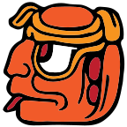
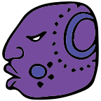

# Mr. Dario

A Dr. Mario-style browser game with a TypeScript simulation core, React web client, SocketCluster server, and a terminal client.

<p>
  
  
  
</p>

## What It Is

Mr. Dario is a browser-playable Dr. Mario-style puzzle game. The current game supports local single-player play and server-backed high scores

The roadmap is online multiplayer: shared match setup, deterministic gameplay, rollback/replay support for late inputs, spectators, and server verification for authoritative results.

The core package is `mrdario-core`: it owns the deterministic game simulation separately from rendering, transport, and UI concerns.

## Requirements

- Node 20 (`nvm use`)
- npm 10
- Redis for server-backed flows and integration tests

## Install

```sh
npm install
```

## Run Locally

Run these in separate terminals:

```sh
npm run watch -w mrdario-core
npm run start -w mrdario-server
npm run start -w mrdario-client-web
```

Then open <http://localhost:6868>.

For server debugging:

```sh
npm run start:debug -w mrdario-server
```

## Useful Commands

```sh
npm run build -w mrdario-core
npm run test -w mrdario-core
npm run build -w mrdario-server
npm run build -w mrdario-client-web
npm run test -w mrdario-integration
```

Use npm workspace commands for dependency changes so manifests and the root lockfile stay coherent.

## Docs

- [Project status](docs/status.md)
- [Roadmap](docs/roadmap.md)
- [Modernization and netcode notes](docs/notes/2026-04-18-modernization-and-netcode-notes.md)
- [Lessons learned](docs/lessons-learned.md)
